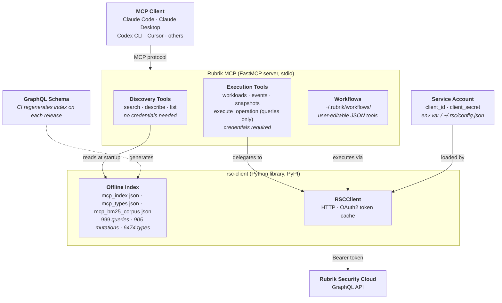

# Rubrik MCP

An MCP server that gives AI assistants access to the [Rubrik Security Cloud](https://www.rubrik.com/) GraphQL API — no custom integration required, no hardcoded queries, no schema knowledge needed upfront.

Ask questions in plain language. The server handles discovery, query construction, and execution against your live RSC environment.

---

## What you can do

**Ask anything about your RSC environment:**
> "Which VMs haven't had a successful backup in the last 24 hours?"
> "Show me all workloads out of compliance with their SLA."
> "What events failed overnight on the Atlanta cluster?"
> "Take an on-demand snapshot of prod-db-01 and wait for it to finish."

The built-in discovery tools cover the entire RSC GraphQL API — 999 queries, 905 mutations, and 6,474 types — so the AI can find the right operation for any question without you having to know the API upfront.

**Get runnable code for write operations:**

This server is query-only for raw GraphQL execution. When you ask for a write operation that isn't covered by a built-in tool (like taking a snapshot), the server returns the attempted operation and Claude generates a Python code sample you can run directly:

```python
from rubrik_security_cloud import RSC
import asyncio

async def main():
    async with RSC() as rsc:
        result = await rsc.execute(
            "mutation AssignSla($input: AssignSlasInput!) { assignSlas(input: $input) { success } }",
            variables={"input": {"...": "..."}}
        )
        print(result)

asyncio.run(main())
```

**Save common operations as your own tools:**

Once you've had a useful conversation, you can tell the AI to save it as a reusable workflow:

> "Save this as a workflow called `rsc_compliance_report`."

The next time you ask, it's a single tool call instead of multi-step discovery — using fewer tokens and responding faster. Workflows are plain JSON files stored in `~/.rubrik/workflows/` that you can edit, share, or version-control.

**Works with any MCP-compatible client:**

Claude Code, Claude Desktop, OpenAI Codex CLI, Cursor, Windsurf, Continue, VS Code Copilot agent mode, and any other client that supports stdio MCP transport.

---

## Security

This server authenticates to Rubrik Security Cloud using a service account. Depending on the service account's assigned role, it may have access to sensitive data.

> **The service account credential in your config file is equivalent to a password with API-level access to your RSC environment. Treat it accordingly.**

### Checklist

**Assign a least-privilege role**
Create a dedicated RSC role with only the permissions your workflows actually need. A read-only role is sufficient for monitoring and reporting. Configure it at **Settings > Users and Roles > Roles**.

**Rotate service account secrets regularly**
Client secrets do not expire by default. Rotate them on a schedule (monthly at minimum) at **Settings > Users and Roles > Service Accounts**, then update your local credentials file or environment variable. Use `chmod 600` on any file that contains a `client_secret`.

**Enable Quorum Authorization for destructive operations**
RSC's Quorum Authorization feature requires a second authorized user to approve sensitive operations before they execute — snapshot deletion, SLA policy changes, cluster configuration, and others. This adds a human checkpoint even when the service account has the necessary permissions. Configure it at **Settings > Security > Quorum Authorization**.

**Configure the RSC IP allowlist**
Restrict which IP addresses are permitted to authenticate to your RSC instance at **Settings > Security > IP Allowlist**. Add only the IPs or CIDR ranges from which this MCP server will run. This limits the blast radius if credentials are compromised.

**Review RSC audit logs**
All API activity performed by the service account is recorded in RSC's audit log at **Reports > Audit Logs**. Review it periodically.

**Do not commit credentials to version control**
The service account JSON file contains a `client_secret`. Do not commit it to git, share it in chat or email, or store it in a world-readable location.

---

## Installation

### Prerequisites

- Python 3.10 or later
- A Rubrik Security Cloud account with a service account (for execution tools)

### Install via agent prompt

If you're using Claude Code, paste this into the chat and the agent will handle the rest:

> "Install the Rubrik MCP from `https://github.com/rubrikinc/rubrik` and add it to my Claude Code MCP configuration. My RSC service account JSON is at `~/.rsc/service_account.json`."

For Claude Desktop, the agent will edit your config file directly:

> "Install the Rubrik MCP from `https://github.com/rubrikinc/rubrik` and add it to my Claude Desktop config. My RSC service account JSON is at `~/.rsc/service_account.json`."

You'll need your service account JSON file ready before running these — see [Authenticate](#authenticate) if you haven't set one up yet.

### Install manually

**Using pip:**

```bash
pip install git+https://github.com/rubrikinc/rubrik.git
```

**Using uv:**

```bash
uv pip install git+https://github.com/rubrikinc/rubrik.git
```

After installation, note the full path to the command — you will need it for client configuration:

```bash
which rubrik
# example: /Users/you/.venv/bin/rubrik
```

### Authenticate

The discovery tools require no credentials. The execution tools require a Rubrik Security Cloud service account.

Obtain a service account from your RSC instance: **Settings > Users and Roles > Service Accounts**.

Provide credentials using **one** of the following methods:

**Option A — Service account JSON file (recommended)**

```json
{
  "client_id": "client|...",
  "client_secret": "...",
  "access_token_uri": "https://<your-rsc-domain>/api/client_token"
}
```

Save to a file (e.g. `~/.rsc/service_account.json`) and set:

```bash
export RSC_SERVICE_ACCOUNT_FILE=/path/to/service_account.json
```

**Option B — Individual environment variables**

```bash
export RSC_URL=https://<your-rsc-domain>
export RSC_CLIENT_ID=client|...
export RSC_CLIENT_SECRET=...
```

**Option C — Config file at `~/.rsc/config.json`**

```json
{
  "client_id": "client|...",
  "client_secret": "...",
  "access_token_uri": "https://<your-rsc-domain>/api/client_token"
}
```

The client checks for credentials in this order: `RSC_SERVICE_ACCOUNT_FILE` → individual env vars → `~/.rsc/config.json`.

### Configure your MCP client

**Claude Code:**

```bash
claude mcp add rubrik -- /path/to/rubrik -e RSC_SERVICE_ACCOUNT_FILE=/path/to/service_account.json
```

Verify it's registered:

```bash
claude mcp list
```

**Claude Desktop** — edit `~/Library/Application Support/Claude/claude_desktop_config.json` (macOS) or `%APPDATA%\Claude\claude_desktop_config.json` (Windows):

```json
{
  "mcpServers": {
    "rubrik": {
      "command": "/path/to/rubrik",
      "env": {
        "RSC_SERVICE_ACCOUNT_FILE": "/path/to/service_account.json"
      }
    }
  }
}
```

**Other MCP clients (generic stdio):**

```json
{
  "name": "rubrik",
  "transport": "stdio",
  "command": "/path/to/rubrik",
  "env": {
    "RSC_SERVICE_ACCOUNT_FILE": "/path/to/service_account.json"
  }
}
```

---

## Built-in tools

### Discovery (no credentials needed)

These tools work entirely offline using a pre-built index of the RSC schema. No network, no auth required.

| Tool | Description |
|------|-------------|
| `rsc_search_operations` | Find queries/mutations by keyword |
| `rsc_describe_operation` | Full argument signature for an operation |
| `rsc_describe_operation_full` | Operation signature with all input types expanded inline |
| `rsc_describe_type` | Fields/values for a GraphQL type |
| `rsc_list_queries` | All query names |
| `rsc_list_mutations` | All mutation names |
| `rsc_list_types` | All type names |
| `rsc_list_types_matching` | Filter type names by substring |

### Execution (credentials required)

| Tool | Description |
|------|-------------|
| `rsc_get_workloads` | List workloads with protection, compliance, usage, and backup status |
| `rsc_get_events` | Get recent events and activity, always scoped to a time window |
| `rsc_take_on_demand_snapshot` | Trigger an on-demand backup for a workload |
| `rsc_wait_for_job` | Poll a backup job until it completes |
| `rsc_execute_operation` | Run any raw GraphQL query (mutations are not supported — Claude will generate Python code instead) |

### Workflows (credentials required)

Multi-step operations are saved as user-editable JSON files and automatically registered as callable tools on startup.

| Tool | Description |
|------|-------------|
| `rsc_save_workflow` | Save a workflow from conversation context |
| `rsc_list_workflows` | List all workflows in your directory |
| `rsc_delete_workflow` | Remove a workflow |

**Starter workflows** (seeded to `~/.rubrik/workflows/` on first run):

| Workflow | Description |
|----------|-------------|
| `rsc_snapshot_and_wait` | Take an on-demand snapshot for a cloud-native workload and poll until it completes |
| `rsc_protection_gaps` | Out-of-compliance workloads + recent backup failures in one combined call |
| `rsc_find_and_snapshot` | Find a workload by name, snapshot it, and wait for completion |

---

## Saving your own tools

When you find yourself asking the same question repeatedly, save it. After a useful conversation:

> "Save this as a workflow so I can reuse it."

The AI calls `rsc_save_workflow`, which writes a JSON file to `~/.rubrik/workflows/`. On the next restart, that workflow is registered as a named MCP tool.

**Why this matters for token efficiency:** answering an ad-hoc question requires the AI to search the schema, describe types, construct a query, and execute it — several round trips and hundreds of tokens of schema context per invocation. A saved workflow collapses that into a single tool call with a pre-built GraphQL operation. Repeated operations become cheaper and faster over time.

Workflow files are plain JSON — open them in any editor, tweak the query, change the defaults, or share them with your team.

---

## Community workflows

Additional workflows contributed by the community — including threat feed management, SLA operations, and more — are available in the [rubrik-community](https://github.com/rubrikinc/rubrik-community) repository. To install one, copy the JSON file into `~/.rubrik/workflows/` and restart your MCP client.

**Contributing:** if you build a workflow that would be useful to others, open a pull request in the community repo. Add the JSON file to `workflows/` and update the README table. No code required — just the JSON spec.

---

## Architecture



- **Discovery tools** are fully offline — they read pre-generated JSON indexes that ship with `rsc-client`; no network, no auth
- **Execution tools** instantiate `RSCClient`, which loads credentials, gets an OAuth2 token, and fires the GraphQL request
- **Workflows** are JSON specs that chain tool calls; the engine resolves `${step.field}` references between steps
- **rsc-client** keeps the schema index current — CI regenerates it from the SDL on each Rubrik release

---

## Development setup

```bash
git clone https://github.com/rubrikinc/rubrik.git
cd rubrik
python3 -m venv .venv && source .venv/bin/activate
pip install -e .
```

To develop against a local `rsc-client` checkout instead of PyPI:

```bash
git clone https://github.com/rubrikinc/rubrik-security-cloud-python-graphql-client.git
pip install -e ../rubrik-security-cloud-python-graphql-client
```
