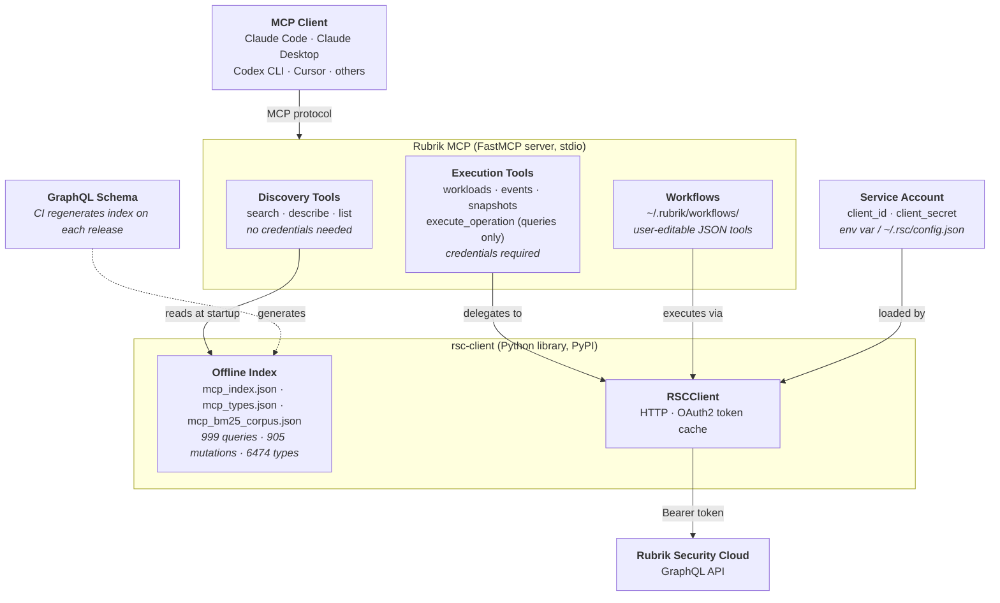

# Advanced reference

This document covers the full built-in tools table, architecture, community workflows, and development setup. For installation and getting started, see the [README](../README.md).

---

## Built-in tools

### Discovery (no credentials needed)

These tools work entirely offline using a pre-built index of the RSC schema. No network, no auth required.

| Tool | Description |
|------|-------------|
| `rsc_search_operations` | Find queries/mutations by keyword |
| `rsc_describe_operation` | Full argument signature for an operation |
| `rsc_describe_operation_full` | Operation signature with all input types expanded inline |
| `rsc_search_fields` | Search for fields by name or description across all types |
| `rsc_describe_type` | Fields/values for a GraphQL type |
| `rsc_list_types_matching` | Filter type names by substring |
| `rsc_list_queries` | All query names |
| `rsc_list_mutations` | All mutation names |
| `rsc_list_types` | All type names |

### Execution (credentials required)

| Tool | Description |
|------|-------------|
| `rsc_execute_operation` | Run any raw GraphQL query (mutations are not supported — Claude generates Python code instead) |
| `rsc_get_workloads` | List workloads with protection, compliance, usage, and backup status |
| `rsc_get_events` | Get recent events and activity, always scoped to a time window |
| `rsc_take_on_demand_snapshot` | Trigger an on-demand backup for a workload |
| `rsc_wait_for_job` | Poll a backup job until it completes |
| `rsc_assign_sla` | Assign an SLA domain to one or more workloads |
| `rsc_onboard_host` | Register a host so Rubrik can protect workloads running on it |
| `rsc_get_active_sessions` | List users currently logged in to RSC |

### Composite tools

These are built-in multi-step workflows that cover common end-to-end operations.

| Tool | Description |
|------|-------------|
| `rsc_find_and_snapshot` | Find a workload by name and take an on-demand snapshot |
| `rsc_snapshot_and_wait` | Take a snapshot for a cloud-native workload and poll to completion |
| `rsc_protection_gaps` | Out-of-compliance workloads and recent backup failures in one call |
| `rsc_threat_triage_for_workload` | Anomaly detection, threat monitoring, sensitive data exposure, and quarantine list for a workload |
| `rsc_fileset_partial_success_detail` | Detailed reasons for fileset PARTIAL_SUCCESS backup events |
| `rsc_get_active_sessions` | List users currently logged in to RSC |

### Workflow management

| Tool | Description |
|------|-------------|
| `rsc_save_workflow` | Save a multi-step workflow as a named, callable MCP tool |
| `rsc_list_workflows` | List all workflows in `~/.rubrik/workflows/` |
| `rsc_delete_workflow` | Remove a saved workflow |

---

## Architecture



- **Discovery tools** are fully offline — they read pre-generated JSON indexes that ship with `rsc-client`; no network, no auth
- **Execution tools** instantiate `RSCClient`, which loads credentials, obtains an OAuth2 token, and fires the GraphQL request
- **Workflows** are JSON specs that chain tool calls; the engine resolves `${step.field}` references between steps
- **rsc-client** keeps the schema index current — CI regenerates it from the SDL on each Rubrik release

The server entry point is `src/rubrik/server.py`. Workflow files are plain JSON stored in `~/.rubrik/workflows/` and auto-registered as tools on startup.

---

## Community workflows

Additional workflows contributed by the community — threat feed management, SLA operations, compliance reporting, and more — are available in the [rubrik-community](https://github.com/rubrikinc/rubrik-community) repository.

To install a community workflow, copy the JSON file into `~/.rubrik/workflows/` and restart your MCP client.

To contribute a workflow you've built, open a pull request in the community repo. Add the JSON file to `workflows/` and update the README table. No code changes required — just the JSON spec.

---

## Development setup

```bash
git clone https://github.com/rubrikinc/rubrik.git
cd rubrik
python3 -m venv .venv && source .venv/bin/activate
pip install -e .
```

To develop against a local `rsc-client` checkout instead of PyPI:

```bash
git clone https://github.com/rubrikinc/rubrik-security-cloud-python-graphql-client.git
pip install -e ../rubrik-security-cloud-python-graphql-client
```

The server runs in stdio mode (for MCP clients):

```bash
rubrik-mcp
```

The offline schema index is loaded at startup from `rsc-client`'s `mcp_index.json` and `mcp_types.json`. If the RSC schema changes, update the Python client's indexes first, then restart the server.
